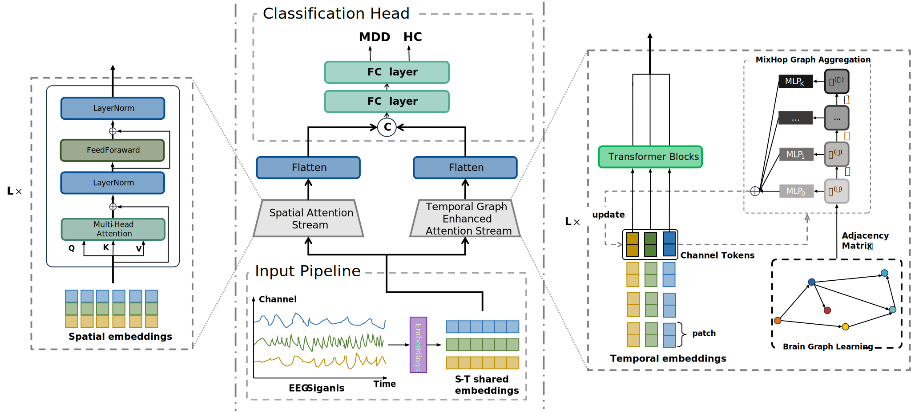

# STGE-Former: Spatial-Temporal Graph-Enhanced Transformer for EEG-Based Major Depressive Disorder Detection

[](README_CN.md)



## Overview

This repository contains the official implementation of **STGE-Former** (Spatial-Temporal Graph-Enhanced Transformer), a novel deep learning framework for detecting Major Depressive Disorder (MDD) from EEG signals. Our model achieves state-of-the-art performance on the MODMA dataset by effectively capturing both spatial and temporal dependencies in EEG data.


## Model Architecture

The overall framework of the STGE-Former mainly comprises four components:

1. **Input Pipeline**: Preprocesses and prepares EEG signals for feature extraction
2. **Spatial Attention Stream**: Models functional connectivity among different brain regions using graph attention mechanisms
3. **Temporal Graph-Enhanced Attention Stream**: Captures brain activity correlations across various time intervals with enhanced transformer architecture
4. **Classification Head**: Integrates spatiotemporal features for final depression detection

As shown in the framework diagram, these components work collaboratively to extract and fuse both spatial and temporal features for optimal depression classification performance.

## Installation

### Python Environment
- Python 3.8+
- PyTorch 1.10+
- CUDA 11.3+ (for GPU acceleration)

### MATLAB/EEGLAB Environment (Optional)
For EEG data preprocessing, you can use the provided MATLAB script:
- MATLAB 2023
- EEGLAB 2023.1

### Setup
```bash
git clone https://github.com/RockyChen0205/STGE-Former.git
cd STGE-Former
pip install -r requirements.txt
```

## Dataset Preparation

### MODMA Dataset
1. Download the MODMA dataset from the official source
2. Place the raw EEG files in the `data/` directory
3. Run preprocessing scripts:

```bash
cd preprocess
python eeg_slice.py
```

### Lanzhou 2015 128-Channel Dataset
For the Lanzhou University 128-channel resting-state EEG dataset:

1. **Prepare data paths** in `preprocess/eeg_preprocess_batch.m`:
   - Set `data_path` to your raw `.mat` EEG files directory
   - Set the output `filepath` in `pop_saveset` to your desired output directory
   - The electrode location file `preprocess/mychan` is included in the repository

2. **Run MATLAB preprocessing**:
   - Open MATLAB 2023 with EEGLAB 2023.1
   - Run `preprocess/eeg_preprocess_batch.m`
   - The script will:
     - Import raw EEG data (128 channels, 256Hz)
     - Apply 0.1-40Hz bandpass filter
     - Perform ICA decomposition (18 components)
     - Use ICLabel for component classification
     - Remove artifact components (brain, muscle, eye > 90%)
     - Apply average reference
     - Save processed `.set` files

3. **Convert to numpy** for model training:
```bash
cd preprocess
python eeg_slice.py --input /path/to/processed_set_files
```

### Preprocessed Data
The preprocessing pipeline generates:
- Time-series segments in `.set` format
- Corresponding label files
- Processed numpy arrays in `after_process_data/`

## Usage

### Training
Run 10-fold cross-validation on MODMA dataset:

```bash
# For STGE-Former
bash STGEFormer_MODMA_10fold.sh

# Alternative models
bash SFormer_MODMA_10fold.sh
bash STFormer_MODMA_10fold.sh
bash TGEFormer_MODMA_10fold.sh
```

### Evaluation
Metrics are automatically computed and saved to `results/metrics.txt`
- Accuracy
- Precision
- Recall
- F1-Score
- AUC-ROC

## Citation

If you use this code or our paper in your research, please cite:

```bibtex
@article{chen2025stge,
  title={STGE-Former: Spatial-Temporal Graph-Enhanced Transformer for EEG-Based Major Depressive Disorder Detection},
  author={Chen, Yu and Yang, Chunfeng},
  booktitle={ICASSP 2025-2025 IEEE International Conference on Acoustics, Speech and Signal Processing (ICASSP)},
  pages={1--5},
  year={2025},
  organization={IEEE}
}
```

## Project Structure

```
STGE-Former/
├── data/                 # Raw EEG data files
├── after_process_data/   # Processed numpy arrays
├── data_provider/        # Data loading utilities
├── model/               # Model architectures
│   ├── STGEFormer.py    # Main model implementation
│   ├── Encoder.py       # Transformer encoder
│   ├── embedding.py     # Feature embedding layers
│   └── self_attention.py # Attention mechanisms
├── preprocess/          # Data preprocessing scripts
│   ├── eeg_preprocess_batch.m  # MATLAB/EEGLAB batch processing
│   ├── eeg_slice.py     # Python EEG slicing
│   └── run.sh           # Shell script helpers
├── utils/               # Utility functions
├── results/             # Training results and metrics
├── assets/              # Framework diagrams
└── README.md
```

